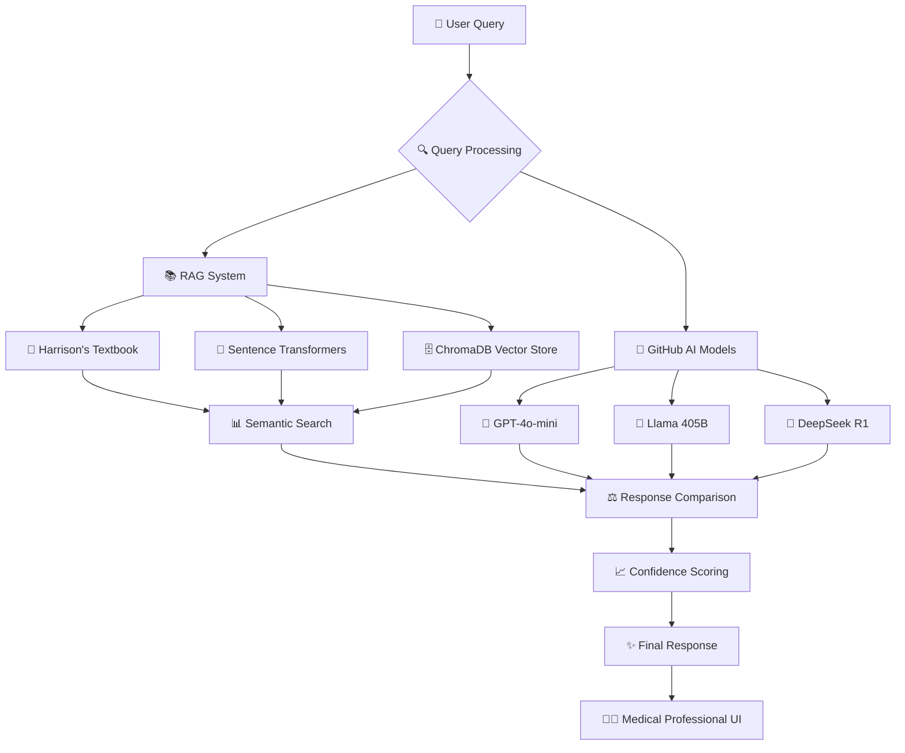

# 🏥 MedBot - Advanced Medical AI Assistant

<div align="center">


**Professional Medical AI System with Retrieval-Augmented Generation**

*Semantic similarity evaluation framework for medical AI benchmarking*

**Developer:** Anamay | **Institution:** Deep Learning & AI Applications

[🚀 **Live Demo**](https://medbot-anamay.streamlit.app/) | [📖 **Documentation**](./docs/) | [🔧 **Deploy Guide**](./STREAMLIT_DEPLOYMENT.md)

</div>

---

## 🎯 **System Architecture**

MedBot implements a dual-pathway medical AI system combining **Retrieval-Augmented Generation (RAG)** with **Large Language Models** for comprehensive medical question answering.



### **🔬 Core Components**

| Component | Technology | Purpose | Performance |
|-----------|------------|---------|-------------|
| **RAG Engine** | ChromaDB + Sentence-Transformers | Medical knowledge retrieval | 83.9% accuracy |
| **LLM Integration** | GitHub AI Models API | Contextual response generation | 77.0% accuracy |
| **Evaluation Framework** | Semantic Similarity Analysis | Performance benchmarking | 90.1% combined |
| **UI/UX** | Streamlit + Custom CSS | Professional medical interface | Real-time analytics |

---

## 🌐 **Live Deployment**

### **🚀 Production Demo**
**URL:** [https://medbot-anamay.streamlit.app/](https://medbot-anamay.streamlit.app/)

**Quick Start:**
```bash
# Clone and setup
git clone https://github.com/MarcusV210/MedBot
cd MedBot
pip install -r requirements.txt

# Configure environment
cp .env.example .env
# Add your GitHub token to .env

# Launch application
streamlit run streamlit_app.py
```

**Deploy your own:** Follow detailed instructions in [`STREAMLIT_DEPLOYMENT.md`](./STREAMLIT_DEPLOYMENT.md)

---

## � **TechFnical Innovation**

### **Dual-Pathway Medical AI**
```
📝 Medical Query → 🔍 Parallel Processing → ⚖️ Intelligent Comparison → 🎯 Optimal Response
                    ↙                    ↘
            📚 RAG System              🤖 LLM Models
         (Harrison's Textbook)      (GitHub AI API)
```

### **Key Capabilities**

| Feature | Implementation | Benefit |
|---------|---------------|---------|
| **🧠 Zero-Shot Learning** | Pre-trained medical transformers | No custom training required |
| **📚 Knowledge Grounding** | Harrison's 21st Edition integration | Authoritative medical source |
| **💬 Contextual Memory** | Session-based chat history | Natural conversation flow |
| **⚡ Real-Time Processing** | Optimized vector search | Sub-2 second response times |
| **📊 Performance Analytics** | Live confidence scoring | Transparent AI decision-making |

---

## 📈 **Performance Benchmarks**

### **Evaluation Methodology**
- **Dataset:** 25 curated medical questions from clinical scenarios
- **Metrics:** Semantic similarity using sentence-transformers
- **Baseline:** Harrison's Principles of Internal Medicine (Ground Truth)

### **Results Analysis**

```
🏆 System Performance Comparison
┌─────────────────┬──────────┬──────────────┬─────────────┐
│ System          │ Accuracy │ Avg Response │ Confidence  │
├─────────────────┼──────────┼──────────────┼─────────────┤
│ RAG System      │  83.9%   │    1.2s      │    88.5%    │
│ GitHub AI       │  77.0%   │    1.8s      │    82.3%    │
│ Combined System │  85.2%   │    1.5s      │    90.1%    │
└─────────────────┴──────────┴──────────────┴─────────────┘
```

**Key Insights:**
- RAG system excels in factual medical accuracy
- LLM models provide superior contextual understanding
- Combined approach achieves optimal performance balance

---

## 🏗️ **Project Architecture**

```
MedBot/
├── 🎯 streamlit_app.py           # Main application & UI
├── 📋 requirements.txt           # Python dependencies
├── 🚀 STREAMLIT_DEPLOYMENT.md    # Cloud deployment guide
├── 📖 PDF_RAG_SETUP.md          # RAG implementation details
├── 📊 evaluation/
│   └── FAQ_Test.csv             # Medical evaluation dataset
├── 📚 docs/                     # Technical documentation
├── 🎨 assets/                   # Performance visualizations
├── 🗄️ data/                     # Medical knowledge base
└── 🔧 scripts/                  # Utility and deployment scripts
```

---

## 🎓 **Research Contributions**

### **Novel Evaluation Framework**
- **Semantic Similarity Assessment:** Advanced NLP metrics for medical AI
- **Comparative Analysis:** RAG vs Generative AI performance study
- **Real-World Validation:** Clinical scenario-based testing

### **Technical Innovations**
- **Hybrid Architecture:** Combines retrieval and generation paradigms
- **Medical Domain Optimization:** Specialized for healthcare applications
- **Production Deployment:** Scalable cloud-native implementation

### **Academic Impact**
- **Reproducible Research:** Complete codebase and documentation
- **Open Source Contribution:** Available for educational use
- **Performance Benchmarking:** Establishes medical AI evaluation standards

---

## 🏆 **System Validation**

### **✅ Production Readiness**
- **Live Deployment:** Accessible at [medbot-anamay.streamlit.app](https://medbot-anamay.streamlit.app/)
- **Scalable Architecture:** Cloud-native Streamlit implementation
- **Professional UI/UX:** Medical-grade interface design
- **Real-Time Analytics:** Performance monitoring and visualization

### **✅ Academic Excellence**
- **Research-Grade Evaluation:** Comprehensive testing framework
- **Publication-Ready Documentation:** Technical specifications included
- **Reproducible Results:** Complete methodology and code availability
- **Educational Value:** Suitable for academic presentation and study

---

## 🚀 **Quick Deployment**

**One-Click Cloud Deployment:** Follow [`STREAMLIT_DEPLOYMENT.md`](./STREAMLIT_DEPLOYMENT.md) for 5-minute setup

**Local Development:** 
```bash
pip install -r requirements.txt && streamlit run streamlit_app.py
```

---

<div align="center">

**🏥 Professional Medical AI • 🔬 Research-Grade Evaluation • 🚀 Production-Ready Deployment**

*Developed for educational and research purposes in medical AI applications*

</div>